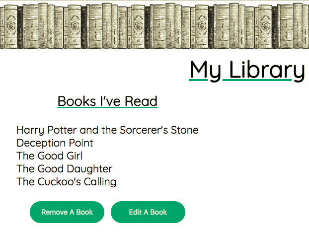

## My Library

This is a React application used for storing and adding books that you have read and books that you want to read. A graph auto populates the total number of books read and unread.

## How to Use

* Click on the front-end URL below to view the current list of books read, the list of books unread, the number of books read and unread plotted on a graph, and a form for adding books.
* To edit an existing book, click "Edit A Book", select which book you would like to edit, make changes to the desired fields, and click "Update Book".
* To remove an existing book, click "Remove A Book", select which book you would like to remove, and click "Remove The Selected Book".
* To add a book, fill out the form under "Add A Book to the List", and select whether you have read the book. If you have read the book, the form will prompt you to fill in additional information. When the form is complete, click "Add Book" and the book will be added to the end of the selected list.

## Links
[Deployed front-end URL](https://my-library-tracker.firebaseapp.com/)  
[Deployed API URL for books read](https://dry-meadow-55679.herokuapp.com/booksread)  
[Deployed API URL for books unread]( https://dry-meadow-55679.herokuapp.com/booksunread)  
[Code repo for graph](https://github.com/FormidableLabs/victory).

## Technologies
React.js, HTML, CSS, Express, Knex, PostgreSQL, Firebase, Heroku

## Author

Allison Livingston  
Email: allisonlivingston16@gmail.com  
LinkedIn: https://www.linkedin.com/in/allisonlivingston16/
